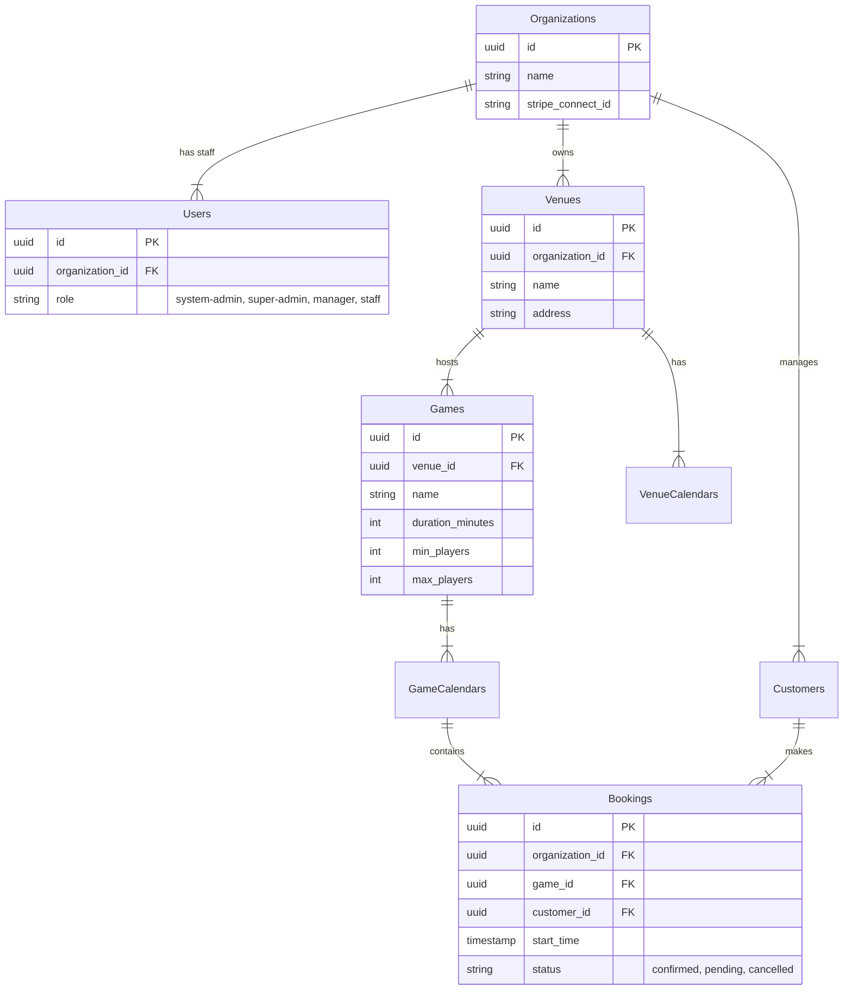

# Booking TMS - Architecture & Development Blueprint

> [!IMPORTANT]
> This document serves as the **Source of Truth** for the Booking TMS architecture. All developers and AI agents should refer to this guide before making significant architectural changes.

## 1. Project Overview

**Booking TMS (Tenant Management System)** is a multi-tenant SaaS platform designed for venue-based businesses (Escape Rooms, Arcades, Entertainment Centers). It allows organizations to manage their venues, games, bookings, customers, and staff through a centralized dashboard.

### Key Capabilities
- **Multi-Tenancy:** Strict data isolation between organizations.
- **Booking Engine:** Complex scheduling logic with support for multiple venues and game-specific calendars.
- **Role-Based Access Control (RBAC):** Granular permissions for System Admins, Owners, Managers, and Staff.
- **Hybrid Payments:** Integration with Stripe Connect for platform fees and direct tenant payouts.

---

## 2. Technology Stack

### Frontend
- **Framework:** React 18 (SPA)
- **Build Tool:** Vite 6
- **Language:** TypeScript
- **Styling:** Tailwind CSS v4 (CSS-first configuration), Radix UI (Headless primitives), Lucide React (Icons)
- **State Management:** React Query (`@tanstack/react-query`) for server state, React Context for global app state (Auth, Notifications).
- **Routing:** React Router DOM v6
- **Forms:** React Hook Form + Zod

### Backend (Supabase)
- **Database:** PostgreSQL 15+
- **Authentication:** Supabase Auth (JWT based)
- **API:** Supabase JS Client (Auto-generated types from schema)
- **Security:** Row Level Security (RLS) policies enforced at the database level.

---

## 3. Architecture Overview

### Multi-Tenancy Model
The system uses a **Discriminator Column** strategy for multi-tenancy.
- Every core table (`venues`, `games`, `bookings`, `customers`) has an `organization_id` column.
- **Row Level Security (RLS)** policies automatically filter data based on the authenticated user's `organization_id`.
- **Super Admins** have bypass privileges to view all data (implemented via specific RLS policies or service role keys in Edge Functions).

### Authentication Flow
1.  **Login:** User authenticates via Supabase Auth.
2.  **Session:** A JWT is issued containing the user's `sub` (UUID).
3.  **Profile Load:** The app fetches the `users` table profile to get the `role` and `organization_id`.
4.  **Context:** `AuthContext` provides the `currentUser` object to the app.
5.  **Protection:** `AdminLayout` checks permissions before rendering routes.

---

## 4. Data Architecture

### Core Schema (Simplified)



### Database Conventions
- **IDs:** UUID v4 (`uuid_generate_v4()`).
- **Timestamps:** `created_at` and `updated_at` (managed by triggers).
- **Foreign Keys:** Always use `ON DELETE CASCADE` or `SET NULL` to maintain referential integrity.
- **Denormalization:** Some fields (e.g., `venue_name` in `bookings`) are denormalized for performance, maintained by database triggers.

---

## 5. Design System & UI Guidelines

### Styling Strategy (Tailwind v4)
We use **Tailwind CSS v4** with a CSS-first configuration in `src/index.css`.
- **Colors:** Defined as CSS variables (e.g., `--color-brand-500`) referenced in Tailwind classes.
- **Dark Mode:** Supported via `.dark` class and CSS variables.

### Component Architecture
- **Primitives:** Use `@radix-ui` primitives for complex interactive components (Dialogs, Popovers, Dropdowns) to ensure accessibility.
- **UI Library:** Reusable components are located in `src/components/ui/` (Button, Input, Card).
- **Icons:** Use `lucide-react` for all icons.

### Layouts
- **AdminLayout:** The main shell for authenticated users (Sidebar + Header + Content Area).
- **AuthLayout:** For Login/Register pages.
- **PublicLayout:** For booking widgets and external pages.

---

## 6. Development Guidelines

### Directory Structure
```
src/
├── components/
│   ├── layout/       # Layout components (Sidebar, Header)
│   ├── ui/           # Generic UI components (Button, Input)
│   ├── widgets/      # Booking widget specific components
│   └── [feature]/    # Feature-specific components
├── lib/
│   ├── auth/         # Auth context and permissions
│   ├── supabase/     # Supabase client configuration
│   └── utils.ts      # Helper functions (cn, formatters)
├── pages/            # Page components (mapped to routes)
├── types/            # TypeScript interfaces and types
└── App.tsx           # Main application entry & routing
```

### Coding Standards
1.  **TypeScript:** Strict mode is enabled. Avoid `any`. Define interfaces for all props and data models.
2.  **Naming:**
    - Components: `PascalCase` (e.g., `BookingCard.tsx`)
    - Functions/Variables: `camelCase` (e.g., `calculateTotal`)
    - Files: Match the export (usually PascalCase for components, camelCase for utils).
3.  **Async Handling:** Use `async/await`. Always wrap Supabase calls in `try/catch` blocks or use React Query's error handling.
4.  **Imports:** Use absolute paths (if configured) or consistent relative paths. Group imports: React -> 3rd Party -> Local.

### Adding New Features
1.  **Database:** Create a new migration file in `supabase/migrations/` for any schema changes.
2.  **Types:** Update TypeScript interfaces to match the new schema.
3.  **UI:** Build components using the existing Design System.
4.  **Logic:** Implement business logic in custom hooks or service files, not directly in UI components if complex.
