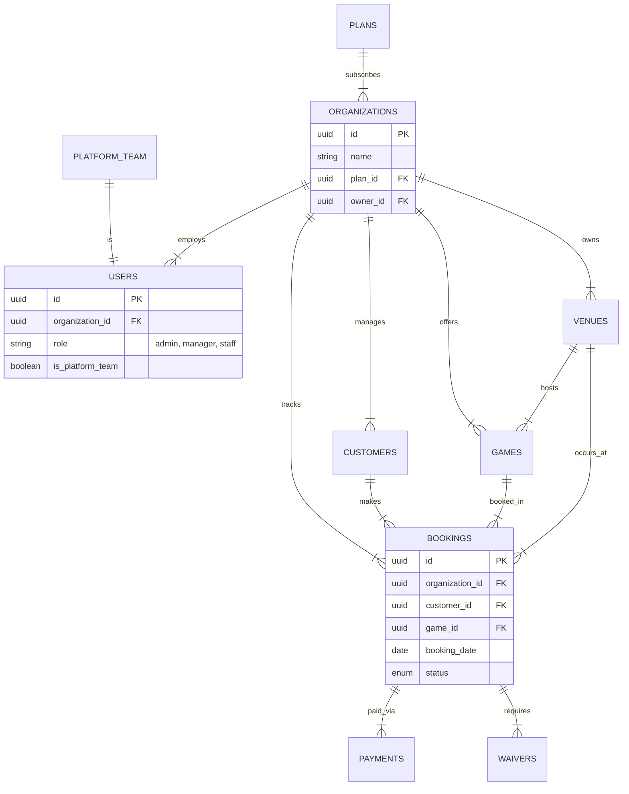
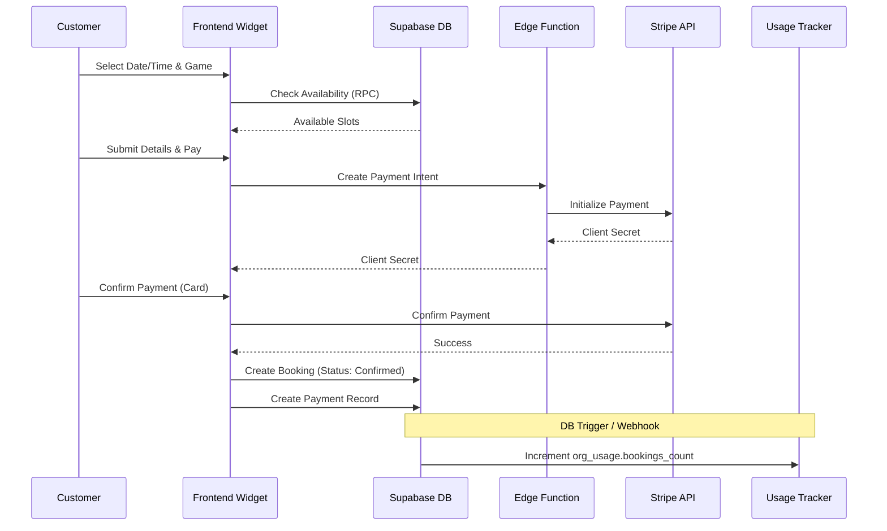
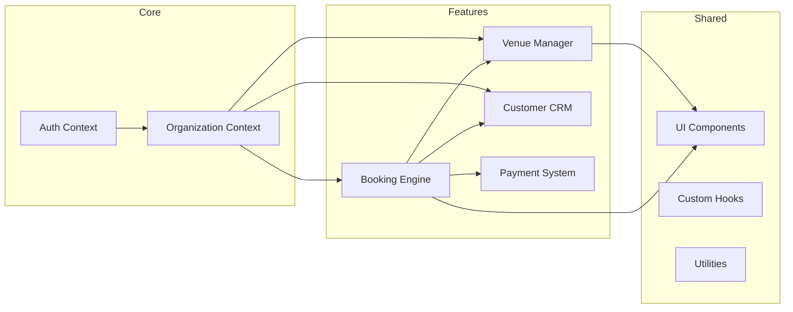

# System Architecture Review & Organization

## 1. Executive Summary
The **BookingTMS** project is a multi-tenant SaaS platform designed for booking and venue management. It is currently in a **Beta Dev** phase (v0.1/v0.2) with a robust architectural foundation already documented and partially implemented.

The system uses a **Shared Database with Row-Level Security (RLS)** model for tenant isolation, which is a scalable and secure approach for SaaS. The core technology stack is **React (Vite)** for the frontend and **Supabase** (PostgreSQL, Auth, Edge Functions) for the backend, with **Stripe Connect** for payments.

## 2. Current System Overview

### Core Architecture
- **Multi-Tenancy**: Implemented via `organization_id` columns on all tenant-scoped tables and enforced by RLS policies.
- **Role-Based Access Control (RBAC)**: Distinct roles for Platform Team (`system-admin`, `super-admin`) and Tenant Users (`admin`, `manager`, `staff`).
- **Database**: PostgreSQL (Supabase) with a clear separation between "Platform Layer" (global) and "Tenant Layer" (organization-specific).

### Key Modules
| Module | Status | Description |
|--------|--------|-------------|
| **Core/Auth** | ✅ Mature | Supabase Auth + Custom `users` table with RBAC and RLS. |
| **Multi-Tenancy** | ✅ Mature | `organizations` table, plan limits, and isolation logic are defined. |
| **Booking Engine** | 🚧 In Progress | `bookings` table exists with complex logic for slots/calendars. |
| **Services/Venues** | 🔄 Transition | `venues` and `games` (being renamed to `service_items`) exist. |
| **Payments** | ✅ Integrated | Stripe Connect integration with `payments`, `refunds`, and `plans`. |
| **Admin Dashboard** | 🚧 In Progress | Separate views for System Admin vs. Org Owner. |

## 3. Logical Organization

We have organized the existing functionality into the requested logical groups:

### 3.1 Core / Multi-tenant System
- **Entities**: `organizations`, `users`, `plans`, `platform_team`, `feature_flags`.
- **Functionality**: Tenant provisioning, user authentication, role management, subscription plan enforcement.
- **Code Location**: `src/core`, `src/contexts/AuthContext`, `supabase/migrations/024_...`, `030_...`.

### 3.2 Booking & Ticketing
- **Entities**: `bookings`, `venue_calendars`, `game_calendars`, `waivers`.
- **Functionality**: Availability checking, slot generation, reservation management, check-in/out.
- **Code Location**: `src/features/bookings`, `src/components/calendar`.

### 3.3 Services / Experiences Management
- **Entities**: `venues`, `games` (or `service_items`), `pricing_tiers`.
- **Functionality**: Venue configuration, room/game setup, dynamic pricing rules.
- **Code Location**: `src/features/venues`, `src/features/games`.

### 3.4 Customers / CRM
- **Entities**: `customers`.
- **Functionality**: Guest profiles, booking history, segmentation (VIP, New).
- **Code Location**: `src/features/customers`.

### 3.5 Payments & Stripe Integration
- **Entities**: `payments`, `refunds`, `stripe_connect_accounts`.
- **Functionality**: Payment processing, split payments (Connect), refund handling, subscription billing.
- **Code Location**: `src/features/stripe`, `supabase/migrations/026_...`.

### 3.6 PPC Tracking & Analytics
- **Entities**: `organization_usage`, `webhook_events`, `audit_logs`.
- **Functionality**: Usage metering (bookings/month), event tracking, system audit trails.
- **Code Location**: `src/features/analytics` (implied), `src/features/reports`.

### 3.7 Admin & Dashboard Tools
- **Entities**: `system_config`, `notifications`.
- **Functionality**: Platform-wide settings, tenant oversight, notification center.
- **Code Location**: `src/pages/admin`, `src/features/dashboard`.

### 3.8 API & Frontend Structure
- **Frontend**: React + Vite + TailwindCSS.
- **API**: Supabase Client (Direct DB access via RLS) + Edge Functions (for complex logic like payments).
- **Structure**: Feature-based folder structure (`src/features/*`).

## 4. Visual Diagrams

### 4.1 High-Level System Architecture

```mermaid
graph TD
    subgraph "Frontend (Client)"
        Browser[Web Browser]
        ReactApp[React App (Vite)]
        Browser --> ReactApp
    end

    subgraph "Backend (Supabase)"
        Auth[GoTrue Auth]
        DB[(PostgreSQL DB)]
        Realtime[Realtime Engine]
        Edge[Edge Functions]
        Storage[File Storage]
        
        ReactApp -- "Auth & Data (RLS)" --> Auth
        ReactApp -- "Queries (REST/WS)" --> DB
        ReactApp -- "Updates" --> Realtime
        ReactApp -- "Complex Logic" --> Edge
        ReactApp -- "Assets" --> Storage
    end

    subgraph "External Services"
        Stripe[Stripe Payments]
        Email[Email Service (Resend)]
    end

    Edge -- "Process Payment" --> Stripe
    Edge -- "Send Email" --> Email
    Stripe -- "Webhooks" --> Edge
```

### 4.2 Database Entity Relationship Diagram (ERD)



### 4.3 Data Flow: Booking -> Payment -> Tracking



### 4.4 Module Relationship Map



## 5. Gap Analysis & Recommendations

### ✅ What is Correct
*   **Architecture**: The multi-tenant design with RLS is excellent and follows industry best practices.
*   **Documentation**: The project is exceptionally well-documented (`ARCHITECTURE_SUMMARY.md`, `ERD_VISUAL_COMPLETE.md`).
*   **Database Schema**: The schema is normalized and includes necessary constraints for data integrity.

### ⚠️ What is Missing / Needs Attention
*   **Terminology Consistency**: The code uses "Games" but migrations suggest a move to "Service Items". This needs to be standardized in the frontend to avoid confusion.
*   **Frontend-Backend Sync**: Ensure the React components in `src/features` are fully updated to use the latest Supabase RPC functions defined in recent migrations (e.g., `027_system_admin_functions.sql`).
*   **Testing**: While a checklist exists, automated E2E tests for the critical "Booking -> Payment" flow should be prioritized.

### 🔄 Recommended Reorganization
*   **Consolidate Features**: Group `games` and `venues` under a broader `services` or `inventory` module if the move to "Service Items" is confirmed.
*   **Admin Separation**: Clearly separate `src/pages/admin` (System Admin) from `src/pages/dashboard` (Tenant Admin) to prevent logic leakage.

## 6. Next Steps
1.  **Standardize Terminology**: Decide on "Games" vs "Service Items" and apply globally.
2.  **Verify Migrations**: Run a schema diff to ensure the local DB matches the `DATABASE_ARCHITECTURE_COMPLETE.md` spec.
3.  **Component Audit**: Review `src/features/bookings` to ensure it uses the new RLS-compliant queries.
