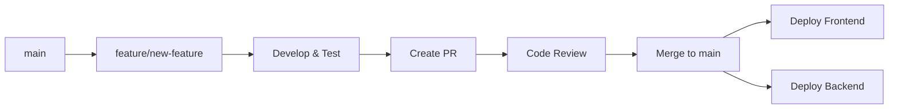

# Repository Structure & Branching Strategy

**Last Updated:** November 15, 2025 04:11 AM UTC+6  
**Repository:** marketingadvisorai/Booking-TMS-Beta-Dev-V0.1-widget-update-0.2  
**Strategy:** Trunk-Based Development with Deployment Branches

---

## Table of Contents

1. [Quick Reference](#quick-reference)
2. [Branch Structure](#branch-structure)
3. [Deployment Configuration](#deployment-configuration)
4. [Workflow Guide](#workflow-guide)
5. [Branch Naming Conventions](#branch-naming-conventions)
6. [Conflict Prevention](#conflict-prevention)
7. [Emergency Procedures](#emergency-procedures)

---

## Quick Reference

### Current Active Branches

| Branch Name | Purpose | Deploy Target | Auto-Deploy | Status |
|------------|---------|---------------|-------------|--------|
| `main` | Production-ready code | Source of truth | ❌ No | 🟢 Active |
| `deploy/production-frontend` | Frontend deployment | Render Static Site | ✅ Yes | 🟢 Live |
| `deploy/production-backend` | Backend deployment | Render Web Service | ✅ Yes | 🟢 Live |
| `develop` | Integration branch | Staging (future) | ❌ No | 🔵 Planned |
| `feature/*` | Feature development | Local/PR | ❌ No | 🟡 Variable |

### Quick Commands

```bash
# Check current branch and status
git status

# Switch to main and update
git checkout main && git pull origin main

# Start new feature
git checkout -b feature/your-feature-name

# Deploy to production (after merge to main)
git push origin main:deploy/production-frontend --force
git push origin main:deploy/production-backend --force
```

---

## Branch Structure

### 1. **`main` Branch** (Protected)

**Purpose:** Single source of truth for production-ready code

**Contains:**
- ✅ All production features
- ✅ Latest stable code
- ✅ Tested and verified changes
- ✅ Complete documentation

**Rules:**
- All code must pass CI/CD checks
- Requires pull request review (recommended)
- Always deployable to production
- Never commit directly (use feature branches)

**Current Commit:** `f9c7c49` - Merge production tag with Coupon & Discount Feature v0.1.6

---

### 2. **`deploy/production-frontend`** (Deployment Branch)

**Purpose:** Dedicated branch for frontend deployment to Render

**Current Name:** `booking-tms-beta-0.1.9` (legacy, will be renamed)  
**New Name:** `deploy/production-frontend` (recommended)  
**Render Service:** `bookingtms-frontend` (srv-d49lmtvdiees73aikb9g)

**Configuration:**
- **Type:** Static Site
- **Root Directory:** `/` (project root)
- **Build Command:** `npm install && npm run build`
- **Publish Directory:** `build`
- **Auto-Deploy:** ✅ Enabled on commit
- **URL:** https://bookingtms-frontend.onrender.com

**Deployment Process:**
```bash
# After merging feature to main, deploy:
git push origin main:deploy/production-frontend --force
```

**What Triggers Deployment:**
- Any commit pushed to this branch
- Changes to frontend code, components, pages
- Changes to `package.json`, `vite.config.ts`
- Changes to root-level configuration files

**What DOESN'T Trigger:**
- Changes only in `src/backend/` directory
- Backend-specific files
- Documentation changes (though they'll be included)

---

### 3. **`deploy/production-backend`** (Deployment Branch)

**Purpose:** Dedicated branch for backend deployment to Render

**Current Name:** `backend-render-deploy` (legacy, will be renamed)  
**New Name:** `deploy/production-backend` (recommended)  
**Render Service:** `bookingtms-backend-api` (srv-d49gml95pdvs73ctdb5g)

**Configuration:**
- **Type:** Web Service (Node.js)
- **Root Directory:** `src/backend`
- **Build Command:** `npm install; npm run build`
- **Start Command:** `npm start`
- **Auto-Deploy:** ✅ Enabled on commit
- **URL:** https://bookingtms-backend-api.onrender.com
- **Region:** Oregon (US West)
- **Plan:** Free tier

**Deployment Process:**
```bash
# After merging backend changes to main, deploy:
git push origin main:deploy/production-backend --force
```

**What Triggers Deployment:**
- Any commit pushed to this branch
- Changes to files in `src/backend/` directory
- Changes to `src/backend/package.json`
- Changes to backend-specific configuration

**What DOESN'T Trigger:**
- Frontend-only changes
- Root `package.json` changes (unless backend deps affected)
- Component changes outside `src/backend/`

---

### 4. **`feature/*` Branches** (Development)

**Purpose:** Individual feature development

**Naming Convention:**
```
feature/payment-integration
feature/user-dashboard
feature/stripe-webhook-handling
feature/booking-calendar-v2
```

**Lifecycle:**
1. Branch from `main`
2. Develop feature
3. Create pull request to `main`
4. After review and merge, delete feature branch
5. Deploy from `main` to production branches

**Example Workflow:**
```bash
# Create feature branch
git checkout main
git pull origin main
git checkout -b feature/new-booking-flow

# Work on feature...
git add .
git commit -m "feat: implement new booking flow"
git push origin feature/new-booking-flow

# After PR merge to main
git checkout main
git pull origin main
git branch -d feature/new-booking-flow

# Deploy to production
git push origin main:deploy/production-frontend --force
```

---

### 5. **Deprecated/Legacy Branches** (To Be Cleaned)

These branches exist but should be archived or deleted:

| Branch | Status | Action Needed |
|--------|--------|---------------|
| `booking-tms-beta-0.1.5` | Old version | 🗑️ Delete after deploy rename |
| `booking-tms-beta-0.1.9` | Current frontend deploy | ⚠️ Rename to `deploy/production-frontend` |
| `backend-render-deploy` | Current backend deploy | ⚠️ Rename to `deploy/production-backend` |
| `render-deploy-0.1` | Old deploy branch | 🗑️ Delete |
| `stripe-api-0.1` | Merged feature | 🗑️ Delete |
| `stripe-integration-0.1.3` | Merged feature | 🗑️ Delete |
| `fixing-10.1` | Old fix branch | 🗑️ Delete |
| `advanced-settings-backup` | Backup branch | 📦 Archive |
| `backup-pre-multi-tenant-*` | Backup branch | 📦 Archive |
| `widget-design-preview-test` | Old test branch | 🗑️ Delete |
| `farebook-restructure-2.0` | Old feature | 🗑️ Delete |
| `Coustomer-Dashboard---BookingTMS` | Typo branch | 🗑️ Delete |

---

## Deployment Configuration

### Render Service Configuration

#### Frontend Service
```yaml
name: bookingtms-frontend
type: static_site
repo: https://github.com/marketingadvisorai/Booking-TMS-Beta-Dev-V0.1-widget-update-0.2
branch: deploy/production-frontend  # To be updated
buildCommand: npm install && npm run build
publishPath: build
autoDeploy: yes
```

#### Backend Service
```yaml
name: bookingtms-backend-api
type: web_service
repo: https://github.com/marketingadvisorai/Booking-TMS-Beta-Dev-V0.1-widget-update-0.2
branch: deploy/production-backend  # To be updated
rootDir: src/backend
buildCommand: npm install; npm run build
startCommand: npm start
autoDeploy: yes
region: oregon
plan: free
```

---

## Workflow Guide

### Standard Development Flow



### Step-by-Step Process

#### 1. Starting a New Feature

```bash
# Ensure main is up to date
git checkout main
git pull origin main

# Create feature branch
git checkout -b feature/your-feature-name

# Make your changes...
git add .
git commit -m "feat: add your feature description"
git push origin feature/your-feature-name
```

#### 2. Creating a Pull Request

1. Go to GitHub repository
2. Click "Compare & pull request"
3. Set base branch to `main`
4. Add description of changes
5. Request review (if team is set up)
6. Address review comments
7. Merge when approved

#### 3. Deploying to Production

**Frontend Deployment:**
```bash
git checkout main
git pull origin main
git push origin main:deploy/production-frontend --force
```

**Backend Deployment:**
```bash
git checkout main
git pull origin main
git push origin main:deploy/production-backend --force
```

**Both Services:**
```bash
git checkout main
git pull origin main
git push origin main:deploy/production-frontend --force
git push origin main:deploy/production-backend --force
```

#### 4. Verifying Deployment

```bash
# Check deployment status on Render dashboard
# Frontend: https://dashboard.render.com/static/srv-d49lmtvdiees73aikb9g
# Backend: https://dashboard.render.com/web/srv-d49gml95pdvs73ctdb5g

# Or test the live URLs
curl https://bookingtms-frontend.onrender.com
curl https://bookingtms-backend-api.onrender.com/health
```

---

## Branch Naming Conventions

### Prefixes and Their Meanings

| Prefix | Purpose | Example | Lifespan |
|--------|---------|---------|----------|
| `feature/` | New features | `feature/payment-gateway` | Temporary |
| `bugfix/` | Bug fixes | `bugfix/booking-validation` | Temporary |
| `hotfix/` | Urgent production fixes | `hotfix/security-patch` | Temporary |
| `refactor/` | Code refactoring | `refactor/database-queries` | Temporary |
| `docs/` | Documentation only | `docs/api-documentation` | Temporary |
| `test/` | Testing/experiments | `test/performance-optimization` | Temporary |
| `deploy/` | Deployment branches | `deploy/production-frontend` | Permanent |
| `release/` | Release preparation | `release/v1.0.0` | Semi-permanent |
| `backup/` | Backup branches | `backup/pre-migration-2025-11` | Archive |

### Naming Best Practices

✅ **Good Examples:**
- `feature/stripe-checkout-integration`
- `bugfix/calendar-timezone-issue`
- `hotfix/payment-validation-error`
- `refactor/booking-service-layer`
- `docs/deployment-workflow`

❌ **Bad Examples:**
- `new-stuff` (too vague)
- `fix` (not descriptive)
- `john-work` (use feature name, not person)
- `booking-tms-beta-0.1.9` (version in branch name is confusing)
- `Coustomer-Dashboard---BookingTMS` (typos, inconsistent formatting)

### Rules for Branch Names

1. **Use lowercase:** `feature/new-dashboard` not `Feature/New-Dashboard`
2. **Use hyphens:** `feature/user-profile` not `feature/user_profile`
3. **Be descriptive:** `feature/payment-stripe-integration` not `feature/payment`
4. **Keep it short:** Max 50 characters
5. **No version numbers:** Use tags for versions, not branch names
6. **No dates:** Unless it's a backup branch `backup/pre-migration-2025-11-15`

---

## Conflict Prevention

### Why Current Structure Could Cause Conflicts

❌ **Current Issues:**
1. `booking-tms-beta-0.1.9` - Version number in branch name suggests it's version-specific, but it's actually the live production frontend
2. Multiple branches with similar purposes (`render-deploy-0.1`, `booking-tms-beta-0.1.5`, etc.)
3. Branch names don't clearly indicate frontend vs backend
4. No clear naming pattern

✅ **Proposed Solutions:**

### 1. Rename Deployment Branches

```bash
# Rename frontend deployment branch
git branch -m booking-tms-beta-0.1.9 deploy/production-frontend
git push origin deploy/production-frontend
git push origin :booking-tms-beta-0.1.9  # Delete old branch

# Rename backend deployment branch
git branch -m backend-render-deploy deploy/production-backend
git push origin deploy/production-backend
git push origin :backend-render-deploy  # Delete old branch

# Update Render service configuration to use new branch names
```

### 2. Clean Up Old Branches

```bash
# Delete merged feature branches
git push origin --delete stripe-api-0.1
git push origin --delete stripe-integration-0.1.3
git push origin --delete fixing-10.1
git push origin --delete render-deploy-0.1
git push origin --delete booking-tms-beta-0.1.5
git push origin --delete widget-design-preview-test
git push origin --delete farebook-restructure-2.0

# Archive backup branches (keep for reference)
# - backup-pre-multi-tenant-20251113-0816
# - advanced-settings-backup
```

### 3. Protect Important Branches

Configure branch protection on GitHub:
- `main` - Require PR reviews, status checks
- `deploy/production-frontend` - Prevent direct pushes (deploy from main only)
- `deploy/production-backend` - Prevent direct pushes (deploy from main only)

### 4. Use Git Tags for Versions

Instead of version numbers in branch names, use git tags:

```bash
# Tag a release
git tag -a v0.1.6 -m "Release v0.1.6: Coupon & Discount Feature"
git push origin v0.1.6

# List all tags
git tag -l

# Checkout a specific version
git checkout v0.1.6
```

---

## Emergency Procedures

### Rollback Production Frontend

```bash
# Find the last working commit
git log deploy/production-frontend

# Rollback to specific commit
git checkout deploy/production-frontend
git reset --hard <commit-hash>
git push origin deploy/production-frontend --force

# This will trigger automatic redeployment on Render
```

### Rollback Production Backend

```bash
# Find the last working commit
git log deploy/production-backend

# Rollback to specific commit
git checkout deploy/production-backend
git reset --hard <commit-hash>
git push origin deploy/production-backend --force

# This will trigger automatic redeployment on Render
```

### Quick Hotfix Process

```bash
# 1. Create hotfix branch from main
git checkout main
git pull origin main
git checkout -b hotfix/critical-bug-fix

# 2. Make the fix
git add .
git commit -m "hotfix: fix critical bug in payment processing"

# 3. Merge to main immediately (no PR for critical fixes)
git checkout main
git merge hotfix/critical-bug-fix

# 4. Deploy immediately
git push origin main
git push origin main:deploy/production-frontend --force
git push origin main:deploy/production-backend --force

# 5. Clean up
git branch -d hotfix/critical-bug-fix
```

### Recover from Bad Deployment

```bash
# 1. Check the last known good deployment
git log deploy/production-frontend --oneline -10

# 2. Force rollback
git push origin <good-commit-hash>:deploy/production-frontend --force

# 3. Fix in a new branch
git checkout -b hotfix/fix-deployment-issue

# 4. Test and redeploy
```

---

## Migration Checklist

### Phase 1: Rename Deployment Branches (Completed Separately)

- [ ] Create `deploy/production-frontend` from `booking-tms-beta-0.1.9`
- [ ] Create `deploy/production-backend` from `backend-render-deploy`
- [ ] Update Render service configuration
- [ ] Test deployments work with new branch names
- [ ] Delete old deployment branches

### Phase 2: Clean Up Old Branches

- [ ] Archive backup branches with documentation
- [ ] Delete merged feature branches
- [ ] Delete old deployment branches
- [ ] Verify no active work on deleted branches

### Phase 3: Configure Branch Protection

- [ ] Protect `main` branch on GitHub
- [ ] Require PR reviews for main
- [ ] Enable status checks
- [ ] Document protection rules

### Phase 4: Team Training

- [ ] Share this documentation with team
- [ ] Conduct workflow training session
- [ ] Create quick reference cards
- [ ] Set up automated reminders

---

## Additional Resources

### Related Documentation

- `DEPLOYMENT_GUIDE.md` - Detailed deployment procedures
- `SETUP_GUIDE.md` - Initial setup and configuration
- `CONTRIBUTING.md` - Contribution guidelines
- `CHANGELOG.md` - Version history and changes

### Useful Commands Reference

```bash
# View all branches
git branch -a

# View remote branches only
git branch -r

# Delete local branch
git branch -d branch-name

# Delete remote branch
git push origin --delete branch-name

# Rename current branch
git branch -m new-name

# See which branches are merged
git branch --merged main

# See which branches are not merged
git branch --no-merged main

# Force sync branch with main
git checkout branch-name
git reset --hard main
git push origin branch-name --force
```

---

## Support

For questions or issues with the branching strategy:

1. Check this documentation first
2. Review related docs in the repository
3. Check deployment logs on Render dashboard
4. Contact the development team lead

**Last Review Date:** November 15, 2025  
**Next Review Due:** December 15, 2025
